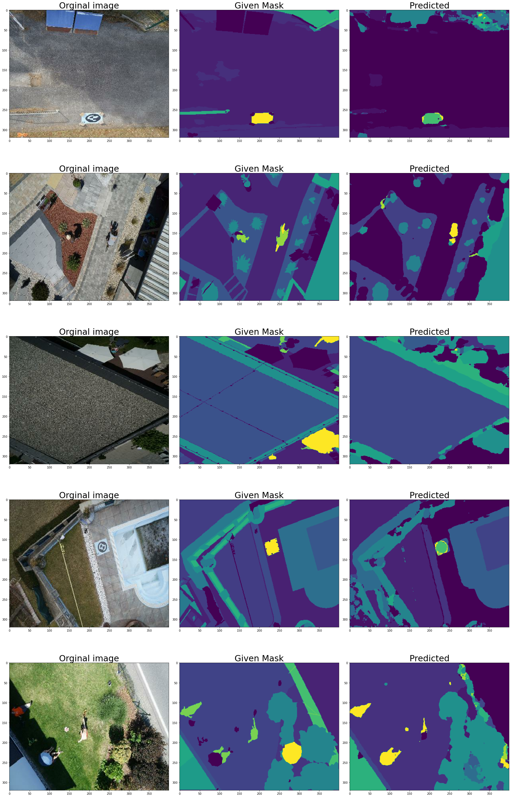

## `Project’s title: Semantic Segmentation of Drone Aerial images` 
### ****Project objective:****
Classify pixels of drone images into one of 23 classes 

<br>


The original dataset(http://dronedataset.icg.tugraz.at) consists of 400 images and their RGB and labeled masks with sizes of 6000X4000 px
# The project consists of 4 parts:
```
     1- Library Importing 
     2- Data Preprocessing
     3- Model compilation and training
     4- Results

```
## The Data Preprocessing step:
```
     1- Image (orginal and labled masks) Resizing to 400X300 px
     
     2- Resized images path Globbing
     
     3- Image augmentaion
     
     4- Creating dataframe from orginal and mask path
     
     5- Create tensorflow's Batch_dataset or keras' custom generator 

```
### Data Augmentaion step:
```
     - Used imgaug library
     - The augmentation pipeline consists of 5 steps:
                            * rotation by 90,180 and 270 degree
                            * flipping vertically and horizontally
                            
     - The result of the augmentation brought the number from 400 to 2400

```

## Keras Model:
```
     - Used mobileUnet with total of 1,941,479 parameters
     - The images were resized again to 320x400 because the network has 4 (2,2) max-pooling in the Contraction path
     - Used ReduceLROnPlateau and Early stoping callbacks during training

```
## Results:
```
    - At the end of 200 epochs:
                                - validation loss and accuracy were 0.3651 and 84.49%
                                - training   loss and accuracy were 0.3681 and 84.47%
    - Using 125 images that were not used for training nor validation the accuracy was 83.93%
       
```

